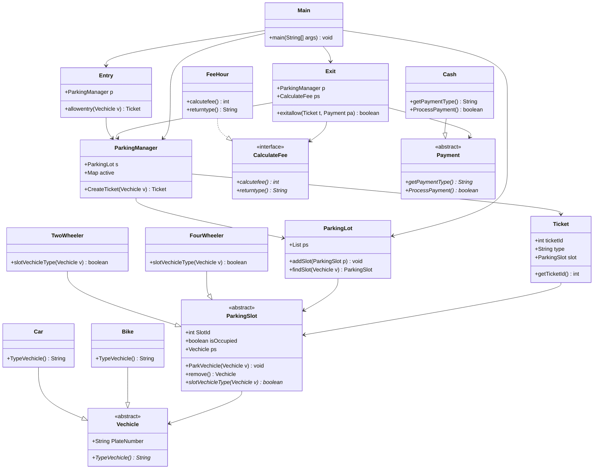

# 🚗 Parking Lot Management System

A Java-based parking lot management system implementing multiple design patterns for flexible and extensible architecture.

## 📋 Overview

This project demonstrates a complete parking lot management system with support for different vehicle types, flexible pricing strategies, and multiple payment methods. The system is built using various design patterns to ensure maintainability and extensibility.

## 🏗️ Architecture & Design Patterns

### 1. **Strategy Pattern** 
- **Purpose**: Flexible pricing strategies
- **Implementation**: `CalculateFee` interface with `FeeHour` and `FeebyDay` implementations
- **Benefits**: Easy to add new pricing models without modifying existing code

### 2. **Template Method Pattern**
- **Purpose**: Consistent behavior across similar objects
- **Implementation**: Abstract classes `ParkingSlot`, `Vechicle`, and `Payment`
- **Benefits**: Enforces common structure while allowing specific implementations

### 3. **Factory Pattern**
- **Purpose**: Centralized object creation
- **Implementation**: `ParkingManager.CreateTicket()` method
- **Benefits**: Encapsulates complex object creation logic

### 4. **Polymorphism**
- **Purpose**: Handle different types uniformly
- **Implementation**: Vehicle hierarchy (`Car`, `Bike`) and Payment hierarchy (`Cash`, `Card`)
- **Benefits**: Code reusability and type safety

## 📁 Project Structure

```
src/
├── Gates/
│   ├── Entry.java          # Vehicle entry management
│   └── Exit.java           # Vehicle exit with payment processing
├── ParkingLot/
│   ├── ParkingLot.java     # Core parking lot management
│   └── ParkingManager.java # Ticket and slot management
├── parkingSlot/
│   ├── ParkingSlot.java    # Abstract parking slot
│   ├── TwoWheeler.java     # Two-wheeler specific slot
│   └── FourWheeler.java    # Four-wheeler specific slot
├── ParkingStrategy/
│   ├── CalculateFee.java   # Pricing strategy interface
│   ├── FeeHour.java        # Hourly pricing
│   └── FeebyDay.java       # Daily pricing
├── payment/
│   ├── Payment.java        # Abstract payment class
│   ├── Cash.java           # Cash payment implementation
│   └── Card.java           # Card payment implementation
├── ticket/
│   └── Ticket.java         # Ticket management
├── vechicle/
│   ├── Vechicle.java       # Abstract vehicle class
│   ├── Car.java            # Car implementation
│   └── Bike.java           # Bike implementation
└── Main.java               # Demo application
```

## 🎯 Key Features

- **Multi-vehicle Support**: Cars and bikes with type-specific parking slots
- **Flexible Pricing**: Hourly and daily pricing strategies
- **Multiple Payment Methods**: Cash and card payments
- **Ticket Management**: Complete ticket lifecycle management
- **Extensible Design**: Easy to add new vehicle types, pricing models, and payment methods

## 🚀 How to Run

### Prerequisites
- Java 8 or higher
- Any Java IDE (IntelliJ IDEA, Eclipse, VS Code)

### Running the Demo
```bash
# Compile the project
javac -d out src/**/*.java src/Main.java

# Run the demo
java -cp out Main
```

### Demo Output
The system demonstrates:
1. **Vehicle Entry**: Creating tickets for different vehicle types
2. **Slot Assignment**: Automatic slot assignment based on vehicle type
3. **Exit Process**: Payment processing with different pricing strategies
4. **Strategy Pattern**: Switching between hourly and daily pricing

## 📊 Class Diagram



## 🔧 Extending the System

### Adding New Vehicle Types
1. Create new class extending `Vechicle`
2. Implement `TypeVechicle()` method
3. Create corresponding parking slot type

### Adding New Pricing Strategies
1. Implement `CalculateFee` interface
2. Add new pricing logic in `calcutefee()` method
3. Inject new strategy into `Exit` class

### Adding New Payment Methods
1. Extend `Payment` abstract class
2. Implement `getPaymentType()` and `ProcessPayment()` methods
3. Use new payment method in exit process

## 🎓 Learning Outcomes

This project demonstrates:
- **Object-Oriented Programming** principles
- **Design Pattern** implementation
- **Clean Architecture** practices
- **Code Organization** and package structure
- **Extensibility** and maintainability


This project is open source and available under the [MIT License](LICENSE).

---

⭐ **Star this repository** if you found it helpful for learning design patterns and Java programming! 
