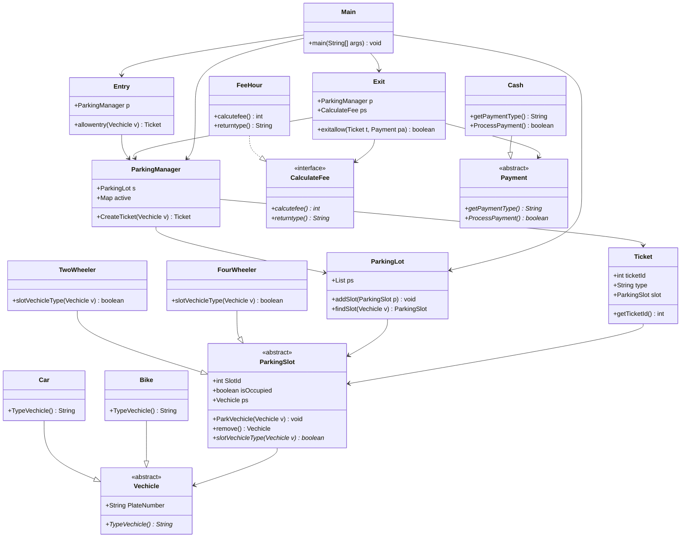

```mermaid
classDiagram
    class Main {
        +main(String[] args) void
    }

    class Vechicle {
        <<abstract>>
        +String PlateNumber
        +TypeVechicle() String*
    }

    class Car {
        +TypeVechicle() String
    }

    class Bike {
        +TypeVechicle() String
    }

    class ParkingSlot {
        <<abstract>>
        +int SlotId
        +boolean isOccupied
        +Vechicle ps
        +ParkVechicle(Vechicle v) void
        +remove() Vechicle
        +slotVechicleType(Vechicle v) boolean*
    }

    class TwoWheeler {
        +slotVechicleType(Vechicle v) boolean
    }

    class FourWheeler {
        +slotVechicleType(Vechicle v) boolean
    }

    class ParkingLot {
        +List ps
        +addSlot(ParkingSlot p) void
        +findSlot(Vechicle v) ParkingSlot
    }

    class ParkingManager {
        +ParkingLot s
        +Map active
        +CreateTicket(Vechicle v) Ticket
    }

    class Ticket {
        +int ticketId
        +String type
        +ParkingSlot slot
        +getTicketId() int
    }

    class Entry {
        +ParkingManager p
        +allowentry(Vechicle v) Ticket
    }

    class Exit {
        +ParkingManager p
        +CalculateFee ps
        +exitallow(Ticket t, Payment pa) boolean
    }

    class CalculateFee {
        <<interface>>
        +calcutefee() int*
        +returntype() String*
    }

    class FeeHour {
        +calcutefee() int
        +returntype() String
    }

    class Payment {
        <<abstract>>
        +getPaymentType() String*
        +ProcessPayment() boolean*
    }

    class Cash {
        +getPaymentType() String
        +ProcessPayment() boolean
    }

    Car --|> Vechicle
    Bike --|> Vechicle
    TwoWheeler --|> ParkingSlot
    FourWheeler --|> ParkingSlot
    Cash --|> Payment
    FeeHour ..|> CalculateFee

    ParkingLot --> ParkingSlot
    ParkingManager --> ParkingLot
    ParkingManager --> Ticket
    Entry --> ParkingManager
    Exit --> ParkingManager
    Exit --> CalculateFee
    Exit --> Payment
    Ticket --> ParkingSlot
    ParkingSlot --> Vechicle

    Main --> ParkingLot
    Main --> ParkingManager
    Main --> Entry
    Main --> Exit
``` 